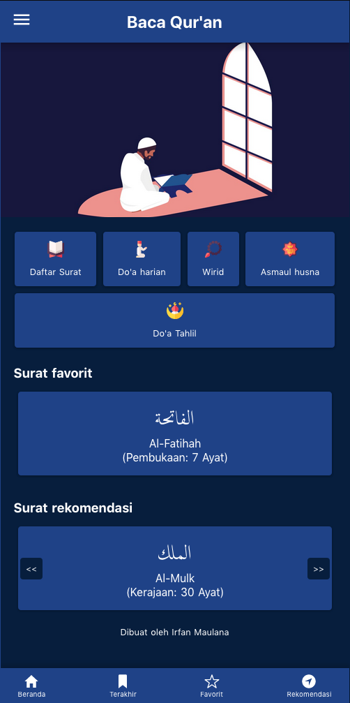

[Baca-Quran.id](https://www.baca-quran.id/) adalah aplikasi web dengan kode sumber terbuka ini bisa teman-teman temukan di Github, web ini saya buat pada awalnya untuk memenuhi kebutuhan pribadi saya akan aplikasi untuk membaca Al-Quran yang sederhana, gratis namun tanpa iklan.
Sangat tidak mengenakkan membaca Al-Quran namun diselipi iklan di beberapa tempat, apalagi banyak iklan yang dipersonalisasi dan seringnya tidak sesuai dengan segmen aplikasi tersebut.

Maka dibuatlah aplikasi ini seadanya, berbasiskan web sehingga teman-teman pengguna tidak perlu repot memasangnya di handphone namun dengan kemampuan PWA sehingga bisa menyimpan data-data yang sudah pernah diakses sebelumnya.
Selama tidak ada pembaruan data ataupun kode dari saya, maka teman-teman bisa mengaksesnya bahkan tanpa internet yang tersambung sekalipun.

Sampai saat ini saya telah menambahkan beberapa fitur yang saya rasa akan mendukung aplikasi ini agar lebih nyaman digunakan, antara lain:

- Menambahkan ayat terakhir dibaca kedalam bookmark
- Menandai beberapa surat favorit
- Membagikan ayat ke sosial media kesayangan
- Mendengarkan murotal bersumber dari Kemenag
- Melihat daftar doa harian, asmaul husna dan wirid setelah sholat yang datanya saya ambil dari beberapa sumber yang telah saya sematkan pula pada aplikasi tersebut

Semoga kedepannya bisa menambahkan berbagai fitur bermanfaat lainnya pada aplikasi ini.

Jika kalian menggunakan aplikasi ini dan berkenan memberikan bantuan, kalian bisa mengunjungi halaman saya di [Trakteer](https://trakteer.id/mazipan).

Terima kasih,

---

Semoga bermanfaat!
