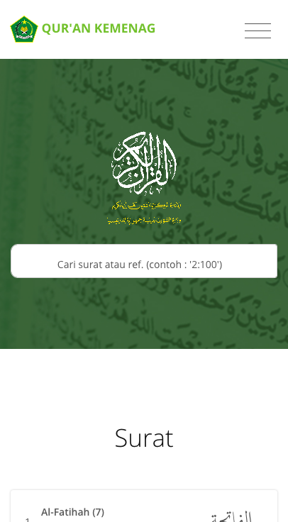
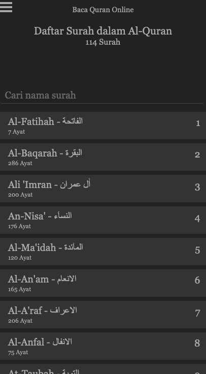
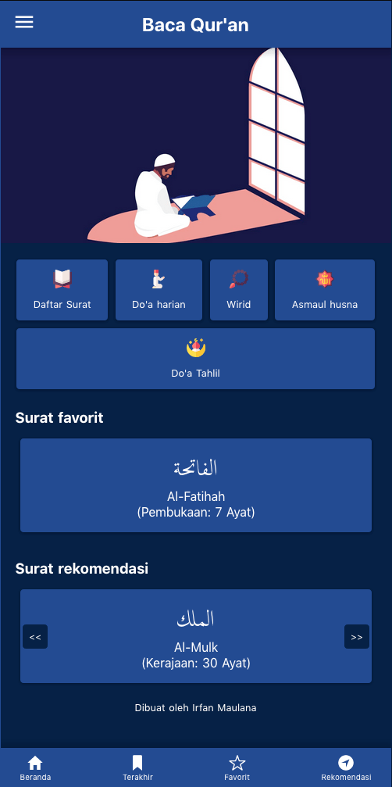

Saya pribadi lebih memilih aplikasi web dibandingkan harus memasang aplikasi native secara langsung lewat Google Play maupun App Store.
Hal ini memudahkan kita karena tidak perlu memberikan ruang yang cukup besar di handphone untuk melakukan pemasangan.
Apalagi bagi pengguna handphone dengan memori yang tidak cukup besar, harus pintar-pintar menentukan mana aplikasi yang benar-benar harus dipasang di handphone dan aplikasi mana yang tidak begitu dibutuhkan.

Berikut ini saya kurasi beberapa aplikasi web Al Qur'an yang bisa teman-teman gunakan sehari-hari untuk membaca Al-Qur'an:

## [Quran Kemenag](https://quran.kemenag.go.id/)

Ini adalah aplikasi web resmi dari Kemenag, jadi sudah pasti ini seharusnya jadi rujukan utama bagi kita masyarakat Indonesia yang ingin menggunakan aplikasi Qur'an.
Tampilannya sangat baik menurut saya, baik pada Desktop (layar dengan ukuran lebar) maupun pada Mobile (Handphone).
Ini menjadi penting karena seringnya kita membaca Al-Qur'an lewat handphone bukan lewat laptop atau komputer.

Menggunakan font yang standard dan enak dibaca membuatnya semakin nyaman digunakan untuk kebutuhan sehari-hari.

## [Quran Web](https://quranweb.id/)

Salah satu rekomendasi dari saya jika teman-teman membutuhkan aplikasi web untuk membaca Al-Qur'an.
Web ini sangat ringan untuk dimuat dan memiliki tampilan yang baik di handphone kalian.
Yang paling keren dari web ini adalah tetap kompatibel dengan handphone jadul, ini karena web ini sangat minim menggunakan JavaScript yang mana supportnya kurang baik di handphone jadul.
Web ini berhasil mengeksekusinya dengan sangat baik.

Memiliki dua tema, mode terang dan mode gelap membuat kalian tetap nyaman membacanya baik siang ataupun malam hari.
Aplikasi ini juga dilengkapi dengan murotal dan yang pasti bebas dari iklan yang menggangu.

## [Sindo](https://kalam.sindonews.com/quran)

Ini merupakan web buatan SindoNews, aplikasinya pada dasarnya memiliki tampilan yang baik dan cukup cepat digunakan.
Hanya saja saat membaca salah satu surat kalian akan diberikan rekomendasi artikel dari SindoNews yang mana bisa jadi mengganggu jika tidak sesuai.
Tetap saja, aplikasi ini masih saya rekomendasikan untuk digunakan sebagai alternatif bagi kalian.

## [Baca-Quran.id](https://www.baca-quran.id/)

Baca-Quran.id menjadi alternatif bagi kalian pengguna handphone yang lebih modern, dengan sumber data yang sama dengan Quran-Web, yakni dari Aplikasi Quran Kemenag.
Baca-Quran.id mendukung berbagai fitur terbaru bawaan browser terbaru, seperti sharing ke sosial media, akses offline dan lainnya.
Memiliki tampilan yang serupa dengan aplikasi native sehingga serasa sedang mengakses aplikasi native tanpa perlu memasang apapun di handphone.
Mendukung tiga tema, terang, gelap dan hijau atau nature.

## [Alquran Indonesia](https://alquran-indonesia.com)

Alquran Indonesia sebenarnya memiliki tampilan yang cukup baik di desktop, sayangnya kurang baik ketika diakses menggunakan handphone.
Beberapa komponen seperti tidak tertata dengan baik.
Enaknya web ini menggunakan ukuran huruf yang cukup besar dengan jenis font yang nyaman untuk dibaca.

## [Tafsir Web](https://tafsirweb.com/#gsc.tab=0)

Web ini sebenarnya lebih cocok digunakan untuk membaca tafsir dibandingkan membaca bacaan Al Qur'an nya.
Tapi web ini juga bisa menjadi alternatif jika membutuhkan aplikasi web Al-Qur'an.
Web ini tidak memiliki iklan tapi sering menampilkan popup modal yang cukup mengganggu pada saat digunakan.

## [Lite Quran](https://litequran.net/)

Pada daftar surat tidak terlihat kalau aplikasi ini memuat iklan, sehingga kesan pertama sangat baik.
Apalagi dengan tampilan sederhana yang membuat aplikasi ini menjadi cukup cepat dan enak diakses.
Sayangnya pada halaman surat terdapat iklannyang cukup besar.
Positifnya web ini punya tampilan yang nyaman, ukuran font yang pas, dan layout yang asik dan tidak capek dilihat untuk digunakan sehari-hari.
Web ini masih masuk dalam rekomendasi saya.

Demikian beberapa rekomendasi aplikasi web pembaca Al-Qur'an yang bisa teman-teman gunakan secara gratis.
Mudah-mudahan teman-teman bisa tetap membaca Al-Qur'an dimanapun saat senggang.
Sehabis sholat, di sela-sela kerja saat santai, malam hari maupun siang hari.
Cukup buka web dan akses aplikasinya, dan mulai membaca.

Mari budayakan membaca Al-Qur'an.

Terima kasih,

---

Semoga bermanfaat!

