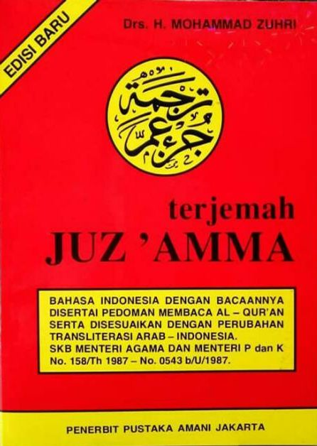

**Juz 30** dalam Al-Quran atau biasanya dikenal dengan **Juz Amma** karena diawali dengan Surat An-Naba' yang diawali dengan ayat yang berbunyi  عَمَّ يَتَسَاۤءَلُوْنَۚ  ('Amma yatasaaa aluun).
Juz 30 merupakan juz terakhir atau pamungkas dari keseluruhan Al-Quran.
Sebagian besar surat dalam juz 30 ini terdiri dari surat-surat pendek yang merupakan ciri khas dari Surat Makkiyah, surat yang diturunkan di Makkah sebelum Rasulullah hijrah ke Madinah.
Meski begitu ada beberapa surat yang juga diturunkan di Madinah seperti Surah [Al-Bayyinah](https://www.baca-quran.id/98/), [Az-Zalzalah](https://www.baca-quran.id/99/), dan [An-Nasr](https://www.baca-quran.id/110/).

Karena banyak terdiri dari surat pendek, makanya di Indonesia biasanya Juz 30 ini dibukukan tersendiri dengan disebut Juz Amma dan diajarkan pada anak-anak sejak dini baik secara hafalan maupun secara bacaan dan tulisan.

Pun bahwa surat-surat dalam juz 30 ini sangat dekat dengan keseharian kita, banyak surat yang secara rutin dibaca pada sholat lima waktu karena pendek dan mudah dihafalkan.

Baca juga artikel [Daftar lengkap Al-Quran 30 juz dan terjemahan bahasa Indonesia](/2020-06-14-daftar-lengkap-surat-alquran-30-juz-dan-terjemahan-bahasa-indonesia/).

Berikut adalah daftar lengkap Juz 30 Al-Quran atau dikenal dengan Juz Amma beserta terjemahan dalam bahasa indonesia yang diurutkan berdasarkan nomor suratnya dalam Al-Quran:

| No. | No. Surat | Nama Surah | Bahasa Arab | Arti | Jumlah Ayat |
|---- |----------- | ----------- |------------ |----- |------------ |
| 1 | 78 | [An-Naba'](https://www.baca-quran.id/78/) | النبأ | Berita Besar | 40 |
| 2 | 79 | [An-Nazi'at](https://www.baca-quran.id/79/) | النّٰزعٰت | Malaikat Yang Mencabut | 46 |
| 3 | 80 | ['Abasa](https://www.baca-quran.id/80/) | عبس | Bermuka Masam | 42 |
| 4 | 81 | [At-Takwir](https://www.baca-quran.id/81/) | التكوير | Penggulungan | 29 |
| 5 | 82 | [Al-Infitar](https://www.baca-quran.id/82/) | الانفطار | Terbelah | 19 |
| 6 | 83 | [Al-Mutaffifin](https://www.baca-quran.id/83/) | المطفّفين | Orang-Orang Curang | 36 |
| 7 | 84 | [Al-Insyiqaq](https://www.baca-quran.id/84/) | الانشقاق | Terbelah | 25 |
| 8 | 85 | [Al-Buruj](https://www.baca-quran.id/85/) | البروج | Gugusan Bintang | 22 |
| 9 | 86 | [At-Tariq](https://www.baca-quran.id/86/) | الطارق | Yang Datang Di Malam Hari | 17 |
| 10 | 87 | [Al-A'la](https://www.baca-quran.id/87/) | الاعلى | Maha Tinggi | 19 |
| 11 | 88 | [Al-Gasyiyah](https://www.baca-quran.id/88/) | الغاشية | Hari Kiamat | 26 |
| 12 | 89 | [Al-Fajr](https://www.baca-quran.id/89/) | الفجر | Fajar | 30 |
| 13 | 90 | [Al-Balad](https://www.baca-quran.id/90/) | البلد | Negeri | 20 |
| 14 | 91 | [Asy-Syams](https://www.baca-quran.id/91/) | الشمس | Matahari | 15 |
| 15 | 92 | [Al-Lail](https://www.baca-quran.id/92/) | الّيل | Malam | 21 |
| 16 | 93 | [Ad-Duha](https://www.baca-quran.id/93/) | الضحى | Duha | 11 |
| 17 | 94 | [Asy-Syarh](https://www.baca-quran.id/94/) | الشرح | Lapang | 8 |
| 18 | 95 | [At-Tin](https://www.baca-quran.id/95/) | التين | Buah Tin | 8 |
| 19 | 96 | [Al-'Alaq](https://www.baca-quran.id/96/) | العلق | Segumpal Darah | 19 |
| 20 | 97 | [Al-Qadr](https://www.baca-quran.id/97/) | القدر | Kemuliaan | 5 |
| 21 | 98 | [Al-Bayyinah](https://www.baca-quran.id/98/) | البيّنة | Bukti Nyata | 8 |
| 22 | 99 | [Az-Zalzalah](https://www.baca-quran.id/99/) | الزلزلة | Guncangan | 8 |
| 23 | 100 | [Al-'Adiyat](https://www.baca-quran.id/100/) | العٰديٰت | Kuda Yang Berlari Kencang | 11 |
| 24 | 101 | [Al-Qari'ah](https://www.baca-quran.id/101/) | القارعة | Hari Kiamat | 11 |
| 25 | 102 | [At-Takasur](https://www.baca-quran.id/102/) | التكاثر | Bermegah-Megahan | 8 |
| 26 | 103 | [Al-'Asr](https://www.baca-quran.id/103/) | العصر | Asar | 3 |
| 27 | 104 | [Al-Humazah](https://www.baca-quran.id/104/) | الهمزة | Pengumpat | 9 |
| 28 | 105 | [Al-Fil](https://www.baca-quran.id/105/) | الفيل | Gajah | 5 |
| 29 | 106 | [Quraisy](https://www.baca-quran.id/106/) | قريش | Quraisy | 4 |
| 30 | 107 | [Al-Ma'un](https://www.baca-quran.id/107/) | الماعون | Barang Yang Berguna | 7 |
| 31 | 108 | [Al-Kausar](https://www.baca-quran.id/108/) | الكوثر | Pemberian Yang Banyak | 3 |
| 32 | 109 | [Al-Kafirun](https://www.baca-quran.id/109/) | الكٰفرون | Orang-Orang kafir | 6 |
| 33 | 110 | [An-Nasr](https://www.baca-quran.id/110/) | النصر | Pertolongan | 3 |
| 34 | 111 | [Al-Lahab](https://www.baca-quran.id/111/) | اللهب | Api Yang Bergejolak | 5 |
| 35 | 112 | [Al-Ikhlas](https://www.baca-quran.id/112/) | الاخلاص | Ikhlas | 4 |
| 36 | 113 | [Al-Falaq](https://www.baca-quran.id/113/) | الفلق | Subuh | 5 |
| 37 | 114 | [An-Nas](https://www.baca-quran.id/114/) | الناس | Manusia | 6 |

Terima kasih,

Semoga bermanfaat!
