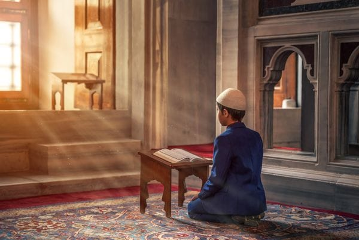

Al Qur'an sebagai Kitab Suci, Wahyu Ilahi, mempunyai adab-adab tersendiri bagi org-org yg membacanya. Adab-adab itu sudah diatur dgn sangat baik, untuk penghormatan dan keagungan Al-Quran, tiap-tiap org harus berpedoman kepadanya dan mengerjakannya.

Photo by [Abdullah Ghatasheh](https://www.pexels.com/@abdghat?utm_content=attributionCopyText&utm_medium=referral&utm_source=pexels) from [Pexels](https://www.pexels.com/photo/photo-of-a-person-kneeling-in-front-of-book-2608353/?utm_content=attributionCopyText&utm_medium=referral&utm_source=pexels)

**Imam Al Ghazali** di dlm kitabnya **Ihya Ulumuddin** telah memperinci dgn sejelas-jelasnya bagaimana hendaknya adab-adab membaca Al Qur'an mjd adab yg mengenal batin, dan adab yg mengenal lahir.

Adab yg mengenal batin itu, diperinci lagi mjd arti memahami asal kalimat, cara hati membesarkan kalimat Allah, menghadirkan hati dikala membaca sampai ke tingkat memperluas, memperhalus perasaan dan membersihkan jiwa. Dgn demikian, kandungan Al Quran yg dibaca dgn perantaraan lidah, dapat bersemi dlm jiwa dan meresap ke dlm hati sanubarinya.

Kesemuanya ini adalah adab yg berhubungan dgn batin, yaitu dgn hati dan jiwa. Sebagai contoh, Imam Al Gazhali menjelaskan, bagaimana cara hati membesarkan kalimat Allah, yaitu bagi pembaca Al Qur'an ketika ia memulainya, maka terlebih dahulu ia harus menghadirkan dlm hatinya, betapa kebesaran Allah yg mempunyai kalimat-kalimat itu. Dia harus yakin dlm hatinya, bahwa yg dibacanya itu bukanlah kalam manusia, tetapi adalah kalam Allah Azza wa Jalla.

Membesarkan kalam Allah itu, bukan saja dlm membacanya, tetapi juga dlm menjaga tulisan-tulisan Al Quran itu sendiri. Sebagaimana yg diriwayatkan, 'Ikrimah bin Abi Jahl, sangat gusar hatinya bila melihat lembaran-lembaran yg bertuliskan Al Quran berserak-serak seolah-olah tersia-sia, lalu ia memungutnya selembar demi selembar, sambil berkata: *"Ini adalah kalam Tuhanku! Ini adalah kalam Tuhanku, membesarkan kalam Allah berarti membesarkan Allah."*

Adapun mengenai adab lahir dlm membaca Al Quran, selain didapati di dlm kitab Ihya Ulumuddin, juga banyak terdapat di dlm kitab-kitab lainnya. Misalnya dlm kitab Al Itqan oleh Al Imam Jalaludin As Suyuthu, tantang adab membaca Al Quran itu di perincinya sampai mjd beberapa bagian Diantara adab-adab membaca Al Quran, yg terpenting ialah:

## Berwudhu

Disunatkan membaca Al Quran sesudah berwudhu, dlm keadaan bersih, sebab yg dibaca adalah wahyu Allah.

## Tangan kanan

Mengambil Al Quran hendaknya dgn tangan kanan, sebaiknya memegangnya dgn kedua belah tangan.

## Berada di tempat yang bersih

Disunatkan membaca Al Quran di tempat yg bersih, seperti di rumah, di surau, di mushalla dan di tempat-tempat lain yg dianggap bersih. Tapi yg paling utama ialah di mesjid.

## Menghadap Kiblat

Disunatkan membaca Al Quran menghadap ke Kiblat, membacanya dgn khusyu' dan tenang; sebaiknya dgn berpakaian yg pantas.

## Mulut dalam keadaan bersih

Ketika membaca Al Quran, mulut hendaknya bersih, tidak berisi makanan, sebaiknya sebelum membaca Al Quran mulut dan gigi dibersihkan terlebih dahulu.

## Membaca Ta'awwudz

Sebelum membaca Al Quran disunatkan membaca ta'awwudz, yg berbunyi: *A'udzubillahi minasy syaithanirrajim*. Sesudah itu barulah dibaca *Bismillahirrahmanir rahim*. Maksudnya, diminta lebih dahulu perlindungan Allah, supaya terjauh pengaruh tipu daya syaitan, sehingga hati dan fikiran tetap tenang di waktu membaca Al Quran, dijauhi dari gangguan. Biasa juga org yg sebelum atau sesudah membaca ta'awwudz itu, berdoa dgn maksud memohon kepada Alah supaya hatinya mjd terang. Doa itu berbunyi sebagai berikut *"Ya Allah bukakanlah kiranya kepada kami hikmat-Mu, dan taburkanlah kepada kami rahmat dan khazanah-Mu, ya Allah yg Maha Pengasih lagi Maha Penyayang."*

## Membaca dengan tartil

Disunatkan membaca Al Quran dgn tartil, yaitu dgn bacaan yg pelan-pelan dan tenang, sesuai dgn firman Allah dlm surat **Al Muzammil (73) ayat 4** : *"....Dan bacalah Al Quran itu dgn tartil"*. Membaca dgn tartil itu lebih banyak memberi bekas dan mempengaruhi jiwa, serta serta lebih mendatangkan ketenangan batin dan rasa hormat kepada Al Quran. Telah berkata Ibnu Abbas r.a.: *"Aku lebih suka membaca surat Al Baqarah dan Ali Imran dgn tartil, daripada kubaca seluruh Al Quran dgn cara terburu-buru dan cepat-cepat."*

## Membaca dengan pernuh perhatian

Bagi org yg sudah mengerti arti dan maksud ayat-ayat Al Quran, disunatkan membacanya dgn penuh perhatian dan pemikiran tentang ayat-ayat yg dibacanya itu dan maksudnya. Cara pembacaan seperti inilah yg dikehendaki, yaitu lidahnya bergerak membaca, hatinya turut memperhatikan dan memikirkan arti dan maksud yg terkandung dlm ayat-ayat yg dibacanya. Dgn demikian, ia akan sampai kepada hakikat yg sebenarnya, yaitu membaca Al Quran serta mendalami isi yg terkandung di dlmnya.Hal itu akan mendorongnya untuk mengamalkan isi Al Quran itu. Firman Allah dlm surat An Nisaa (4) ayat 82 berbunyi sebagai berikut: *"Apakah mereka tidak memperhatikan (isi) Al Quran?..."*

Bila membaca Al Quran yg selalu disertai perhatian dan pemikiran arti dan maksudnya, maka dapat ditentukan ketentuan-ketentuan terhadap ayat-ayat yg dibacanya. Umpamanya: Bila bacaan sampai kepada ayat tasbih, maka dibacanya tasbih dan tahmid; Bila sampai pada ayat Doa dan Istighfar, lalu berdoa dan minta ampun; bila sampai pada ayat azab, lalu meminta perlindungan kepada Allah; bila sampai kepada ayat rahmat, lalu meminta dan memohon rahmat dan begitu seterusnya. Caranya, boleh diucapkan dgn lisan atau cukup dlm hati saja. Diriwayatkan oleh Ahmad dan Abu Daud, dari Ibnu Abbas yg maksudnya sebagai berikut: *Sesungguhnya Rasulullah s.a.w. apabila membaca: "sabbihissma rabbikal a'la" beliau lalu membaca "subhanarobbiyal a'la.*

Diriwayatkan pula oleh Abu Daud, dan Wa-il binHijr yg maksudnya sebagai berikut: *"Aku dgn Rasulullah membaca surat Al Fatihah, maka Rasulullah SAW sesudah membaca walad dholliin lalu membaca aamin.* Demikian juga disunatkan sujud, bila membaca ayat-ayat sajadah, dan sujud itu dinamakan sujud tilawah.

Ayat-ayat sajadah itu terdapat pada 15 tempat yaitu:

- [Surat Al-A'raf](https://www.baca-quran.id/7/) ayat 206
- [Surat Ar-Ra'd](https://www.baca-quran.id/13/) ayat 15
- [Surat An-Nahl](https://www.baca-quran.id/16/) ayat 50
- [Surat Al-Isra'](https://www.baca-quran.id/17/) ayat 109
- [Surat Maryam](https://www.baca-quran.id/19/) ayat 58
- [Surat Al-Hajj](https://www.baca-quran.id/22/) ayat 18 dan ayat 77
- [Surat Al-Furqan](https://www.baca-quran.id/25/) ayat 60
- [Surat An-Naml](https://www.baca-quran.id/27/) ayat 26
- [Surat As-Sajdah](https://www.baca-quran.id/32/) ayat 15
- [Surat Sad](https://www.baca-quran.id/38/) ayat 24
- [Surat Fussilat](https://www.baca-quran.id/41/) ayat 38
- [Surat An-Najm](https://www.baca-quran.id/53/) ayat 62
- [Surat Al-Insyiqaq](https://www.baca-quran.id/84/) ayat 21, dan
- [Surat Al-'Alaq](https://www.baca-quran.id/96/) ayat 19

## Diresapkan arti dan maksudnya

Dlm membaca Al Quran itu, hendaknya benar-benar diresapkan arti dan maksudnya, lebih-lebih apabila sampai pada ayat-ayat yg menggambarkan nasib org-org yg berdosa, dan bagaimana hebatnya siksaan yg disediakan bagi mereka. Sehubungan dgn itu, menurut riwayat, para sahabat banyak yg mencucurkan air matanya di kala membaca dan mendengar ayat-ayat suci Al Quran yg menggambarkan betapa nasib yg akan diderita oleh org-org yg berdosa.

## Suara yang merdu

Disunatkan membaca Al Quran dgn suara yg bagus lagi merdu, sebab suara yg bagus dan merdu itu menambah keindahan islubnya Al Quran. Rasulullah SAW telah bersabda: *"Kamu hiasilah Al Quran itu dgn suaramu yg merdu"* Diriwayatkan, bahwa pada suatu malam Rasulullah SAW menunggu-nunggu istrinya, Sitti 'Aisyah r.a. yg kebetulan agak terlambat datangnya. Setelah ia datang, Rasulullah SAW bertanya kepadanya: *"Bagaimanakah keadaanmu?"* Aisyah RA menjawab : *"Aku terlambat datang, karena mendengarkan bacaan Al Quran seseorg yg sangat bagus lagi merdu suaranya. Belum pernah aku mendengarkan suara sebagus itu."*

Maka Rasulullah SAW terus berdiri dan pergi mendengarkan bacaan Al Quran yg dikatakan Aisyah itu. Rasulullah SAW kembali dan mengatakan kepada Aisyah RA: *"org itu adalah Salim, budak sahaya Abi Huzaifah. Puji-pujian bagi Allah yg telah mjdkan org yg suaranya merdu seperti Salim itu sebagai ummatku."*

Oleh sebab itu, melagukan Al Quran dgn suara yg bagus, adalah disunatkan, asalkan tidak melanggar ketentuan-ketentuan dan tata cara membaca sebagaimana yg telah ditetapkan dlm ilmu qiraat dan tajwid, seperti menjaga madnya, harakatnya (barisnya) idghamnya dan lain-lainnya. Di dlm kitab zawaidur raudhah, diterangkan bahwa melagukan Al Quran dgn cara bermain-main serta melanggar ketentuan-ketentuan seperti tersebut di atas itu, haramlah hukumnya; org yg membacanya dianggap fasiq, juga org yg mendengarkannya turut berdosa.

## Jangan diputuskan di tengah jalan

Sedapat-dapatnya membaca Al Quran janganlah diputuskan hanya karena hendak berbicara dgn org lain. Hendaknya pembacaan diteruskan sampai ke batas yg telah ditentukan, barulah disudahi. Juga dilarang tertawa-tawa, bermain-main dan lain-lain yg semacam itu, ketika sedang membaca Al Quran. Sebab pekerjaan yg seperti itu tidak layak dilakukan sewaktu membaca Kitab Suci dan berarti tidak menghormati kesuciannya.

Itulah diantara adab-adab yg terpenting yg harus dijaga dan diperhatikan, sehingga dgn demikian kesucian Al Quran dapat terpelihara menurut arti yg sebenarnya.

Referensi: [Facebook](https://id-id.facebook.com/notes/zoel-fikr/11-adab-membaca-alquran-lebih-detail/404097707399/)

Terima kasih,

Semoga bermanfaat!
