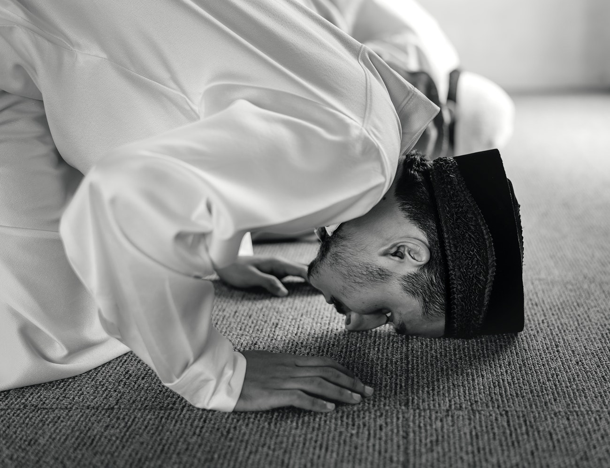

Ayat Sajdah (<bdi class="font-arabic-inline" dir="rtl">اٰية السجدة</bdi>) adalah ayat-ayat tertentu dalam [Al Qur'an](https://www.baca-quran.id/) yang bila dibaca disunnahkan bagi yang membaca dan mendengarnya untuk melakukan sujud tilawah.

Photo by [Chanikarn Thongsupa](https://www.rawpixel.com/pai) from [Rawpixel](https://www.rawpixel.com/image/425647/free-photo-image-muslim-muslim-praying-sujood)

Ayat-ayat sajadah itu terdapat pada 15 tempat yaitu:

### 👉 [Surat Al-A'raf ayat 206](https://www.baca-quran.id/surah/7/206/)

اِنَّ الَّذِيْنَ عِنْدَ رَبِّكَ لَا يَسْتَكْبِرُوْنَ عَنْ عِبَادَتِهٖ وَيُسَبِّحُوْنَهٗ وَلَهٗ يَسْجُدُوْنَ ࣖ

Terjemahan: _"Sesungguhnya orang-orang yang ada di sisi Tuhanmu tidak merasa enggan untuk menyembah Allah dan mereka menyucikan-Nya dan hanya kepada-Nya mereka bersujud."_

### 👉 [Surat Ar-Ra'd ayat 15](https://www.baca-quran.id/surah/13/15/)

وَلِلّٰهِ يَسْجُدُ مَنْ فِى السَّمٰوٰتِ وَالْاَرْضِ طَوْعًا وَّكَرْهًا وَّظِلٰلُهُمْ بِالْغُدُوِّ وَالْاٰصَالِ

Terjemahan: _"Dan semua sujud kepada Allah baik yang di langit maupun yang di bumi, baik dengan kemauan sendiri maupun terpaksa (dan sujud pula) bayang-bayang mereka, pada waktu pagi dan petang hari."_

### 👉 [Surat An-Nahl ayat 50](https://www.baca-quran.id/surah/16/50/)

يَخَافُوْنَ رَبَّهُمْ مِّنْ فَوْقِهِمْ وَيَفْعَلُوْنَ مَا يُؤْمَرُوْنَ

Terjemahan: _"Mereka takut kepada Tuhan yang (berkuasa) di atas mereka dan melaksanakan apa yang diperintahkan (kepada mereka)._

### 👉 [Surat Al-Isra' ayat 109](https://www.baca-quran.id/surah/17/109)

وَيَخِرُّوْنَ لِلْاَذْقَانِ يَبْكُوْنَ وَيَزِيْدُهُمْ خُشُوْعًا

Terjemahan: _"Dan mereka menyungkurkan wajah sambil menangis dan mereka bertambah khusyuk."_

### 👉 [Surat Maryam ayat 58](https://www.baca-quran.id/surah/19/58/)

اُولٰۤىِٕكَ الَّذِيْنَ اَنْعَمَ اللّٰهُ عَلَيْهِمْ مِّنَ النَّبِيّٖنَ مِنْ ذُرِّيَّةِ اٰدَمَ وَمِمَّنْ حَمَلْنَا مَعَ نُوْحٍۖ وَّمِنْ ذُرِّيَّةِ اِبْرٰهِيْمَ وَاِسْرَاۤءِيْلَ ۖوَمِمَّنْ هَدَيْنَا وَاجْتَبَيْنَاۗ اِذَا تُتْلٰى عَلَيْهِمْ اٰيٰتُ الرَّحْمٰنِ خَرُّوْا سُجَّدًا وَّبُكِيًّا

Terjemahan: _"Mereka itulah orang yang telah diberi nikmat oleh Allah, yaitu dari (golongan) para nabi dari keturunan Adam, dan dari orang yang Kami bawa (dalam kapal) bersama Nuh, dan dari keturunan Ibrahim dan Israil (Yakub) dan dari orang yang telah Kami beri petunjuk dan telah Kami pilih. Apabila dibacakan ayat-ayat Allah Yang Maha Pengasih kepada mereka, maka mereka tunduk sujud dan menangis."_

### 👉 [Surat Al-Hajj ayat 18](https://www.baca-quran.id/surah/22/18/)

اَلَمْ تَرَ اَنَّ اللّٰهَ يَسْجُدُ لَهٗ مَنْ فِى السَّمٰوٰتِ وَمَنْ فِى الْاَرْضِ وَالشَّمْسُ وَالْقَمَرُ وَالنُّجُوْمُ وَالْجِبَالُ وَالشَّجَرُ وَالدَّوَاۤبُّ وَكَثِيْرٌ مِّنَ النَّاسِۗ وَكَثِيْرٌ حَقَّ عَلَيْهِ الْعَذَابُۗ وَمَنْ يُّهِنِ اللّٰهُ فَمَا لَهٗ مِنْ مُّكْرِمٍۗ اِنَّ اللّٰهَ يَفْعَلُ مَا يَشَاۤءُ

Terjemahan: _"Tidakkah engkau tahu bahwa siapa yang ada di langit dan siapa yang ada di bumi bersujud kepada Allah, juga matahari, bulan, bintang, gunung-gunung, pohon-pohon, hewan-hewan yang melata dan banyak di antara manusia? Tetapi banyak (manusia) yang pantas mendapatkan azab. Barangsiapa dihinakan Allah, tidak seorang pun yang akan memuliakannya. Sungguh, Allah berbuat apa saja yang Dia kehendaki."_

### 👉 [Surat Al-Hajj ayat 77](https://www.baca-quran.id/surah/22/77/)

يٰٓاَيُّهَا الَّذِيْنَ اٰمَنُوا ارْكَعُوْا وَاسْجُدُوْا وَاعْبُدُوْا رَبَّكُمْ وَافْعَلُوا الْخَيْرَ لَعَلَّكُمْ تُفْلِحُوْنَ

Terjemahan: _"Wahai orang-orang yang beriman! Rukuklah, sujudlah, dan sembahlah Tuhanmu; dan berbuatlah kebaikan, agar kamu beruntung."_

### 👉 [Surat Al-Furqan ayat 60](https://www.baca-quran.id/surah/25/60/)

وَاِذَا قِيْلَ لَهُمُ اسْجُدُوْا لِلرَّحْمٰنِ قَالُوْا وَمَا الرَّحْمٰنُ اَنَسْجُدُ لِمَا تَأْمُرُنَا وَزَادَهُمْ نُفُوْرًا

Terjemahan: _"Dan apabila dikatakan kepada mereka, “Sujudlah kepada Yang Maha Pengasih”, mereka menjawab, “Siapakah yang Maha Pengasih itu? Apakah kami harus sujud kepada Allah yang engkau (Muhammad) perintahkan kepada kami (bersujud kepada-Nya)?” Dan mereka makin jauh lari (dari kebenaran)."_

### 👉 [Surat An-Naml ayat 26](https://www.baca-quran.id/surah/27/26/)

اَللّٰهُ لَآ اِلٰهَ اِلَّا هُوَۙ رَبُّ الْعَرْشِ الْعَظِيْمِ

Terjemahan: _"Allah, tidak ada tuhan melainkan Dia, Tuhan yang mempunyai ‘Arsy yang agung.”_

### 👉 [Surat As-Sajdah ayat 15](https://www.baca-quran.id/surah/32/15/)

اِنَّمَا يُؤْمِنُ بِاٰيٰتِنَا الَّذِيْنَ اِذَا ذُكِّرُوْا بِهَا خَرُّوْا سُجَّدًا وَّسَبَّحُوْا بِحَمْدِ رَبِّهِمْ وَهُمْ لَا يَسْتَكْبِرُوْنَ

Terjemahan: _"Orang-orang yang beriman dengan ayat-ayat Kami, hanyalah orang-orang yang apabila diperingatkan dengannya (ayat-ayat Kami), mereka menyungkur sujud dan bertasbih serta memuji Tuhannya, dan mereka tidak menyombongkan diri."_

### 👉 [Surat Sad ayat 24](https://www.baca-quran.id/surah/38/24/)

قَالَ لَقَدْ ظَلَمَكَ بِسُؤَالِ نَعْجَتِكَ اِلٰى نِعَاجِهٖۗ وَاِنَّ كَثِيْرًا مِّنَ الْخُلَطَاۤءِ لَيَبْغِيْ بَعْضُهُمْ عَلٰى بَعْضٍ اِلَّا الَّذِيْنَ اٰمَنُوْا وَعَمِلُوا الصّٰلِحٰتِ وَقَلِيْلٌ مَّا هُمْۗ وَظَنَّ دَاوٗدُ اَنَّمَا فَتَنّٰهُ فَاسْتَغْفَرَ رَبَّهٗ وَخَرَّ رَاكِعًا وَّاَنَابَ

Terjemahan: _"Dia (Dawud) berkata, “Sungguh, dia telah berbuat zalim kepadamu dengan meminta kambingmu itu untuk (ditambahkan) kepada kambingnya. Memang banyak di antara orang-orang yang bersekutu itu berbuat zalim kepada yang lain, kecuali orang-orang yang beriman dan mengerjakan kebajikan; dan hanya sedikitlah mereka yang begitu.” Dan Dawud menduga bahwa Kami mengujinya; maka dia memohon ampunan kepada Tuhannya lalu menyungkur sujud dan bertobat."_

### 👉 [Surat Fussilat ayat 38](https://www.baca-quran.id/surah/41/38/)

فَاِنِ اسْتَكْبَرُوْا فَالَّذِيْنَ عِنْدَ رَبِّكَ يُسَبِّحُوْنَ لَهٗ بِالَّيْلِ وَالنَّهَارِ وَهُمْ لَا يَسْـَٔمُوْنَ

Terjemahan: _"Jika mereka menyombongkan diri, maka mereka (malaikat) yang di sisi Tuhanmu bertasbih kepada-Nya pada malam dan siang hari, sedang mereka tidak pernah jemu"_

### 👉 [Surat An-Najm ayat 62](https://www.baca-quran.id/surah/53/62/)

فَاسْجُدُوْا لِلّٰهِ وَاعْبُدُوْا ࣖ

Terjemahan: _"Maka bersujudlah kepada Allah dan sembahlah (Dia)."_

### 👉 [Surat Al-Insyiqaq ayat 21](https://www.baca-quran.id/surah/84/21/)

وَاِذَا قُرِئَ عَلَيْهِمُ الْقُرْاٰنُ لَا يَسْجُدُوْنَ

Terjemahan: _"Dan apabila Al-Qur'an dibacakan kepada mereka, mereka tidak (mau) bersujud"_

### 👉 [Surat Al-'Alaq ayat 19](https://www.baca-quran.id/surah/96/19/)

كَلَّاۗ لَا تُطِعْهُ وَاسْجُدْ وَاقْتَرِبْ

Terjemahan: _"sekali-kali tidak! Janganlah kamu patuh kepadanya; dan sujudlah serta dekatkanlah (dirimu kepada Allah)."_

## Beberapa Riwayat Mengenai Sujud Tilawah

Mengutip buku panduan "Shalat Lengkap dan Praktis Sesuai Petunjuk Rasulullah SAW" karya Abdul Kadir, disebutkan hadis dari Abu Hurairah, bahwa Nabi SAW bersabda “Apabila manusia membaca ayat sajdah, kemudian dia sujud, menghindarlah setan dan dia menangis seraya berkata, ‘Hai celaka! Anak Adam disuruh sujud, lantas dia sujud maka baginya surga, dan saya disuruh sujud juga tetapi saya enggan, maka bagi saya neraka.” (HR Muslim).

Sementara itu, diriwayatkan juga dari Ibnu Umar, ”Sesungguhnya, Nabi SAW pernah membaca Al-Quran di depan kami. Ketika bacaanya sampai pada ayat sajdah, beliau bertakbir, lalu sujud, maka kami pun sujud Bersama-sama beliau.” (HR Tirmidzi).

Namun demikian, ada riwayat dari Zaid bin Tsabit yang mengatakan, “Aku membaca Alquran surah an-Najm di hadapan Nabi SAW, beliau tidak sujud pada ayat sajdah.” (HR al-Bukhari).

Oleh sebab itu, disebutkan bahwa tidak sujud tilawah pada saat mengajarkan Alquran, dikarenakan menyusahkan para pelajar dan juga gurunya karena banyaknya siswa.

## Bacaan Sujud Tilawah

Mengutip buku Fasholatan Lengkap: Tuntunan Shalat Lengkap, menyebutkan tata cara sujud tilawah ketika ayat sajdah dibacakan, di mana jika ayat telah dibaca kemudian bisa langsung sujud dengan baca takbir tanpa mengangkat kedua tangan.

Setelah sujud dan selesai membaca bacaan tilawah, gerakan kembali bangun disertai takbir dengan tangan yang tetap tak diangkat.

Secara umum, sujud tilawah sama dengan sujud wajib atau lainnya. Namun demikian, jumlah satu kali sujud tilawah tidak sama dengan sujud lainnya.

Sedangkan cara sujud tilawah di luar shalat, sama saja dengan syarat pada shalat, di mana harus suci dari hadast kecil ataupun besar, menutup aurat, menghadap kiblat dan jika telah masuk waktunya membaca ayat-ayat sajdah.

سَجَدَ وَجْهِي لِلَّذِي خَلَقَهُ وَشَقَّ سَمْعَهُ وَبَصَرَهُ بِحَوْلِهِ وَقُوَّتِهِفَتَبَارَكَ اللَّهُ أَحْسَنُ الْخَالِقِينَ

_“Sajada wajhiya lilladzi khalaqahu washawwarahu wasyaqqa sam’ahu wabasharahu bihaulihi waquwwatihi fatabarakallahu ahsanul khaliqin."_

(Telah sujud wajhku kepada Dzat yang menciptakannya, yang menancapkan pendengaran dan penglihatan dengan daya dan kekuatannya. Mahasuci Allah sebaik-sebaik Pencipta.”

Referensi:

- [Republika](https://republika.co.id/berita/q4foa2320/baca-ayat-sajdah-sunahnya-sujud-bagaimana-cara-dan-doanya)
- [Wikipedia](https://id.wikipedia.org/wiki/Ayat_Sajdah)

Terima kasih,

Semoga bermanfaat!
