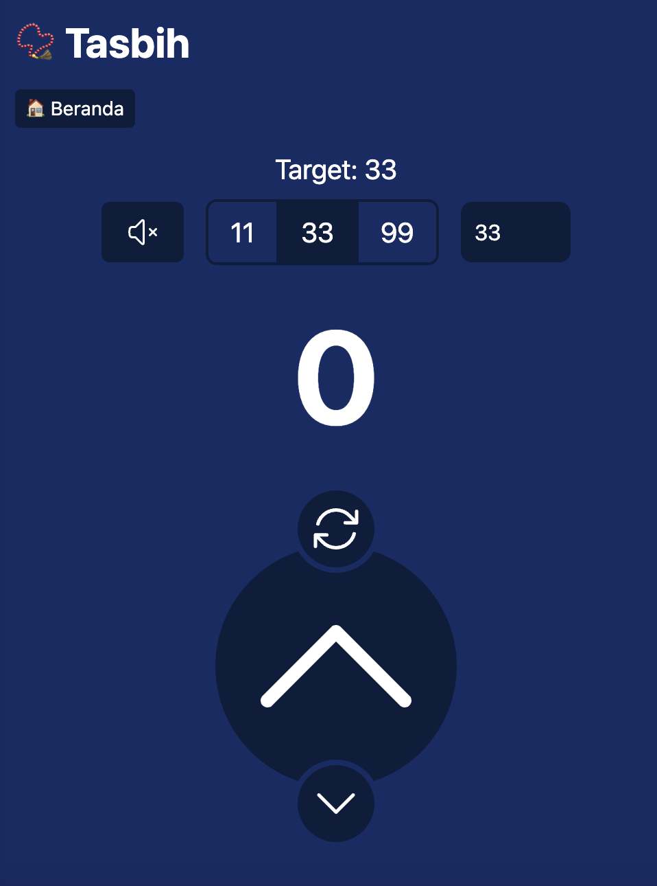

## Apa Itu Tasbih Digital?

Tasbih digital adalah aplikasi yang memungkinkan pengguna untuk menghitung jumlah dzikir melalui perangkat elektronik seperti ponsel atau smartwatch. Aplikasi ini menggantikan tasbih tradisional dengan fitur digital yang praktis dan modern. Selain menghitung dzikir, banyak aplikasi tasbih digital yang dilengkapi dengan fitur tambahan seperti pengingat waktu sholat, kumpulan doa, hingga statistik dzikir harian.

## Manfaat Menggunakan Tasbih Digital

**🤌 Praktis dan Mudah Dibawa**

Tidak perlu membawa tasbih fisik yang mungkin terselip atau hilang. Ponsel Anda bisa menjadi alat serbaguna untuk ibadah, termasuk untuk menghitung dzikir.

**🎯 Akurasi yang Tinggi**

Aplikasi ini membantu mencatat jumlah dzikir dengan akurat tanpa risiko lupa jumlah yang sudah dihitung.

**🧩 Fitur Tambahan**

Banyak aplikasi tasbih digital menyediakan fitur seperti pengingat, kumpulan doa, bahkan statistik progres ibadah, yang bisa menjadi motivasi untuk terus meningkatkan dzikir harian.

**🍀 Ramah Lingkungan**

Dengan menggunakan aplikasi, kita membantu mengurangi kebutuhan akan tasbih berbahan plastik atau kayu, sehingga lebih ramah lingkungan.

## Rekomendasi Aplikasi Tasbih Digital

Kebanyakan aplikasi tasbih digital di luar sana berupa aplikasi yang harus diinstall melalui Play Store maupun AppStore. Jenis aplikasi ini tentu saja bagus, tapi untuk sebagian bagi kita bukanlah pilihan yang efisien dikarenakan keterbatasan penyimpanan untuk menambahkan aplikasi lain. Maka kali ini  saya akan memberikan alternatif aplikasi Tasbih Digital yang bisa digunakan tanpa perlu meng-install alias dalam format web yang bisa dibuka di mana saja selama memiliki peramban (Browser).

Alternatif aplikasi tasbih digital diantaranya:

**✨ [Tasbih.org](https://www.tasbih.org/)**

Tasbih.org merupakan penyedia tasbih digital terpercaya yang tampilannya mudah digunakan, website ini pula yang menjadi inspirasi utama untuk Baca-Quran.id dalam membuat fitur yang serupa.

**✨ [OnlineTasbih.com](https://onlinetasbih.com/)**

OnlineTasbih.com memiliki tampilan unik dengan menyerupai gawai tasbih digital yang sering dijual di berbagai marketplace, dengan tampilan sederhana ini maka memberikan kesan familiar kepada pengguna sehingga terasa mudah untuk digunakan.

**✨ Tasbih dari [Baca-Quran.id](https://www.baca-quran.id/tasbih/)**

Fitur tasbih dari Baca-Quran.id baru diluncurkan pertengahan 2023 lalu. Dengan fitur yang sengaja dibuat sederhana, harapannya juga bisa dengan mudah dipahami dan digunakan oleh pengguna awam sekalipun. Fitur tasbih ini secara bawaan akan memberikan efek getar dengan suara beep kecil setiap kali ditekan, suara beep tersebut kemudian bisa juga dimatikan bila tidak diharapkan. Ditambahkan dengan setelan default target 11, 33, 99 yang merupakan angka umum untuk dicapai saat menggunakan sebuah tasbih.

**✨ [TasbihDigital.com](https://tasbihdigital.com/)**

TasbihDigital.com meskipun cukup oke, sayangnya memiliki banyak iklan bila diakses melalui peramban dan selalu mengarahkan untuk mengunduh versi aplikasinya di Play Store.

## Panduan Menggunakan Fitur Tasbih dari Baca-Quran.id

Berikut adalah panduan bagi pengguna untuk bisa menggunakan fitur tasbih digital melalui Baca-Quran.id:

Kunjungi laman [www.baca-quran.id/tasbih](https://www.baca-quran.id/tasbih/) untuk bisa langsung menggunakan fitur tersebut.

Klik tombol bulat besar "🔼", untuk mulai menghitung dan menambah satu per satu.

Jika Anda menginginkan mode senyap, maka Anda bisa klik tombol "🔇", untuk mematikan suara Beep yang timbul saat menambah jumlah hitungan.

Secara bawaan, target yang akan disetel adalah 33. Anda bisa secara cepat mengubah pilihan ini pada bagian atas. Pilihan yang tersedia secara cepat adalah 11, 33 dan 99. Namun begitu Anda masih bisa juga memilih angka lain sebagai target dengan mengetik manual pada kolom isian disamping angka pilihan 99.

Bila Anda telah mencapai target, maka Anda tidak bisa lagi menambahkan angka lagi, bahkan jika menekan tombol "🔼". Angka akan menjadi merah dan memberikan efek getar yang lebih panjang serta buyi Beep yang lebih keras bila tidak dalam mode sunyi.

Gunakan tombol "🔄" untuk menyetel ulang hitungan ke angka 0 dan memulai lagi hitungan dari awal.

---

Tasbih digital adalah solusi modern yang sangat membantu umat Muslim untuk terus berdzikir di tengah aktivitas sehari-hari. Dengan berbagai fitur canggih, aplikasi ini tidak hanya praktis, tetapi juga menjadi alat yang efektif untuk menjaga kedekatan dengan Allah SWT. Namun, penting untuk selalu mengutamakan niat ibadah dan tidak bergantung sepenuhnya pada teknologi.

Cobalah salah satu aplikasi tasbih digital hari ini dan rasakan manfaatnya! Apa aplikasi tasbih digital favorit Anda?