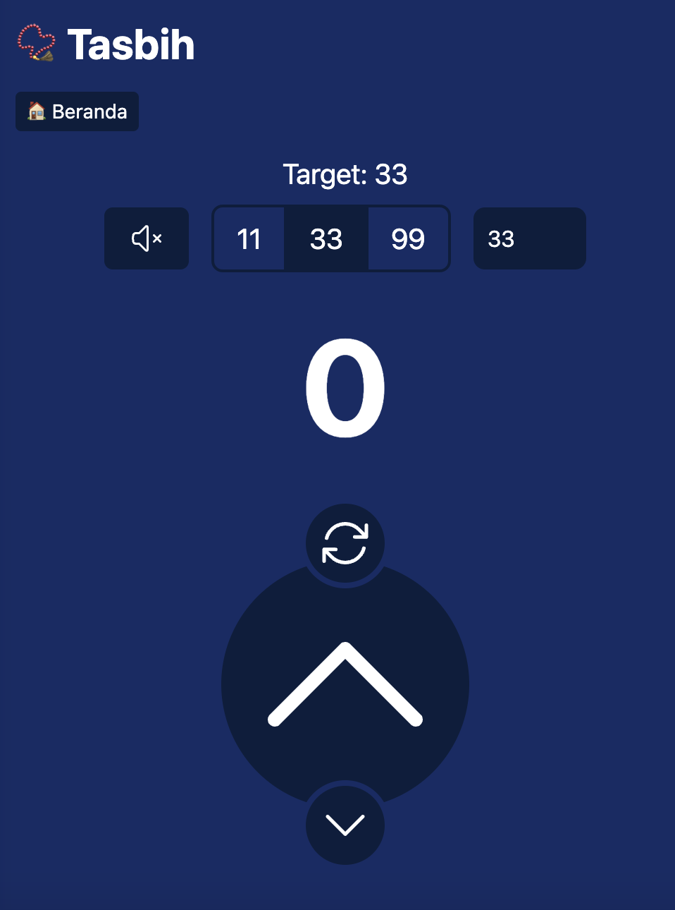

## Apa Itu Tasbih Digital?

Tasbih digital adalah aplikasi yang memungkinkan pengguna untuk menghitung jumlah dzikir melalui perangkat elektronik seperti ponsel atau smartwatch. Aplikasi ini hadir sebagai alternatif modern dari tasbih tradisional, menawarkan kemudahan yang disesuaikan dengan gaya hidup serba digital saat ini. Selain menghitung dzikir, banyak aplikasi tasbih digital yang dilengkapi dengan fitur tambahan seperti pengingat waktu sholat, kumpulan doa, hingga statistik dzikir harian yang membantu kita memantau konsistensi ibadah dari waktu ke waktu.

## Manfaat Menggunakan Tasbih Digital

**Praktis dan Mudah Dibawa**

Salah satu keunggulan terbesar tasbih digital adalah kemudahannya. Kita tidak perlu membawa tasbih fisik yang mungkin terselip, tertinggal, atau bahkan hilang saat bepergian. Ponsel yang hampir selalu ada di tangan kita bisa sekaligus berfungsi sebagai alat bantu dzikir kapan saja dan di mana saja, tanpa perlu repot membawa benda tambahan.

**Akurasi yang Terjaga**

Ketika berdzikir dalam jumlah tertentu, misalnya 33 atau 99 kali, kehilangan hitungan di tengah jalan bisa membuat kita terpaksa mengulang dari awal atau merasa tidak yakin sudah berapa kali. Tasbih digital menyelesaikan masalah ini dengan mencatat setiap ketukan secara akurat, sehingga kita bisa berkonsentrasi penuh pada makna dzikir tanpa terganggu urusan menghitung.

**Fitur yang Mendukung Ibadah Secara Menyeluruh**

Banyak aplikasi tasbih digital yang tidak berhenti hanya pada fungsi menghitung. Fitur statistik dzikir harian, misalnya, membantu kita melihat perkembangan konsistensi ibadah dari hari ke hari dan menjadi motivasi untuk terus meningkatkannya. Pengingat waktu sholat dan koleksi doa yang terintegrasi juga menjadikan satu aplikasi bisa melayani berbagai kebutuhan ibadah sekaligus.

**Ramah Lingkungan**

Dengan memanfaatkan perangkat yang sudah kita miliki, kita turut berkontribusi mengurangi konsumsi barang fisik seperti tasbih berbahan plastik atau kayu yang berpotensi menambah sampah. Ini adalah pilihan kecil yang, jika dilakukan banyak orang, tetap memiliki dampak yang berarti bagi lingkungan.

## Rekomendasi Aplikasi Tasbih Digital

Kebanyakan aplikasi tasbih digital di luar sana tersedia dalam bentuk aplikasi yang harus diinstall melalui Play Store maupun App Store. Jenis aplikasi ini tentu saja bagus, tetapi bagi sebagian orang hal ini bukan pilihan yang efisien karena keterbatasan penyimpanan di ponsel untuk menambahkan aplikasi baru. Berikut beberapa alternatif tasbih digital berbasis web yang bisa digunakan tanpa perlu menginstall apa pun, cukup dibuka melalui peramban (browser) selama ada koneksi internet.

**[Tasbih.org](https://www.tasbih.org/)**

Tasbih.org adalah salah satu penyedia tasbih digital berbasis web yang paling terpercaya. Tampilannya bersih, minimalis, dan sangat mudah digunakan bahkan oleh pengguna yang tidak terbiasa dengan teknologi. Situs ini juga menjadi salah satu inspirasi utama bagi tim Baca-Quran.id dalam merancang fitur tasbih mereka sendiri.

**[OnlineTasbih.com](https://onlinetasbih.com/)**

OnlineTasbih.com memiliki pendekatan desain yang berbeda: tampilannya menyerupai tasbih digital fisik yang sering dijual di marketplace, lengkap dengan tampilan layar seperti gawai. Pendekatan ini memberikan kesan familiar bagi pengguna yang sudah terbiasa dengan tasbih digital berbentuk perangkat keras, sehingga terasa intuitif untuk langsung digunakan.

**Tasbih dari [Baca-Quran.id](https://www.baca-quran.id/tasbih/)**

Fitur tasbih dari Baca-Quran.id diluncurkan pertengahan 2023 dengan filosofi desain yang sederhana dan fokus: mudah digunakan oleh siapa saja, termasuk pengguna awam. Fitur ini secara bawaan memberikan efek getar disertai suara beep kecil setiap kali ditekan sebagai konfirmasi sentuhan, dan suara tersebut bisa dimatikan bila tidak diinginkan. Tersedia juga pilihan target bawaan 11, 33, dan 99 yang merupakan angka umum dalam dzikir, dengan opsi untuk mengisi target custom secara manual jika diperlukan.

**[TasbihDigital.com](https://tasbihdigital.com/)**

TasbihDigital.com menyediakan fungsi dasar tasbih digital yang cukup memadai. Satu catatan yang perlu diketahui adalah keberadaan iklan yang cukup banyak saat diakses melalui browser, dan situs ini cenderung mendorong pengguna untuk mengunduh versi aplikasinya di Play Store. Bagi yang hanya ingin menggunakannya sesekali tanpa instalasi, ini bisa sedikit mengganggu pengalaman berdzikir.

## Panduan Menggunakan Fitur Tasbih dari Baca-Quran.id

Berikut adalah panduan langkah demi langkah untuk menggunakan fitur tasbih digital melalui Baca-Quran.id:

Kunjungi laman [www.baca-quran.id/tasbih](https://www.baca-quran.id/tasbih/) untuk langsung mengakses fiturnya.

Klik tombol bulat besar di tengah layar untuk mulai menghitung dan menambah satu hitungan setiap kali ditekan.

Jika Anda ingin berdzikir dalam suasana yang lebih hening, klik tombol mute untuk mematikan suara beep yang muncul setiap kali hitungan bertambah.

Secara bawaan, target yang ditetapkan adalah 33. Anda bisa dengan cepat mengubah pilihan ini melalui tombol di bagian atas layar. Pilihan cepat yang tersedia adalah 11, 33, dan 99. Namun Anda juga bisa mengetik angka target custom secara manual pada kolom isian yang tersedia.

Bila Anda telah mencapai target, tombol tidak akan menambah hitungan lagi. Angka akan berubah warna menjadi merah dan memberikan efek getar yang lebih panjang disertai bunyi beep yang lebih keras sebagai tanda bahwa target telah tercapai. Gunakan tombol reset untuk menyetel ulang hitungan ke angka 0 dan memulai sesi dzikir baru.

---

Tasbih digital adalah solusi modern yang membantu umat Muslim untuk terus berdzikir di tengah aktivitas sehari-hari tanpa hambatan teknis. Dengan berbagai pilihan yang tersedia, setiap orang bisa menemukan format yang paling nyaman untuk kebiasaan dzikirnya. Yang terpenting, teknologi ini hanyalah alat: keikhlasan niat dan kehadiran hati tetaplah inti dari setiap dzikir yang kita panjatkan kepada Allah SWT.
